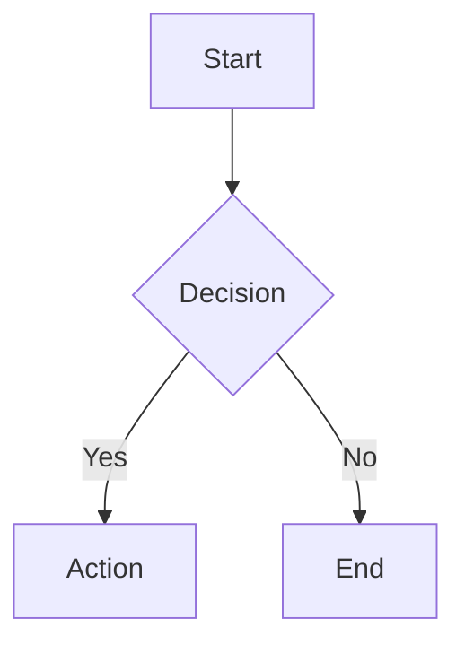

# MkDocs Material Syntax Reference

Quick reference for MkDocs Material formatting patterns.

## Admonitions

**Basic syntax:**
```markdown
!!! note "Optional Title"
    Content indented with 4 spaces.
    Multiple paragraphs supported.
```

**Collapsible (details):**
```markdown
??? note "Click to expand"
    Hidden by default.

???+ warning "Expanded by default"
    Use `+` after `???` to start open.
```

**Types:** `note`, `abstract`, `info`, `tip`, `success`, `question`, `warning`, `failure`, `danger`, `bug`, `example`, `quote`

**Inline (no title):**
```markdown
!!! tip ""
    Content without title bar.
```

## Code Blocks

**With title and line numbers:**
````markdown
```python title="example.py" linenums="1"
def hello():
    return "Hello, World!"
```
````

**Highlight specific lines:**
````markdown
```python hl_lines="2 3"
def example():
    highlighted = True  # line 2
    also_highlighted = True  # line 3
```
````

**Line number start:**
````markdown
```python linenums="10"
# Starts at line 10
```
````

**Code annotations:**
````markdown
```python
def example():
    value = compute()  # (1)!
```

1. This annotation explains the line.
````

## Content Tabs

**Basic tabs:**
```markdown
=== "Tab 1"
    Content for tab 1.

=== "Tab 2"
    Content for tab 2.
```

**Code tabs (common pattern):**
````markdown
=== "Python"
    ```python
    print("Hello")
    ```

=== "JavaScript"
    ```javascript
    console.log("Hello");
    ```
````

## Tables

```markdown
| Header 1 | Header 2 |    Right |
|----------|:--------:|---------:|
| Cell 1   |  Cell 2  |   Cell 3 |
```

Column alignment: `|:-----|` left, `|:---:|` center, `|---:|` right.

## Mermaid Diagrams

````markdown

````

Sequence: replace `flowchart TD` block with `sequenceDiagram` and `Client->>Server: Request` / `Server-->>Client: Response`.

## Links and References

```markdown
[Link text](relative/path/to/page.md)
[Section link](page.md#heading-anchor)
[ref-style][ref-id]

[ref-id]: path/to/page.md "Optional title"
```

## Images, Lists, and Other Features

**Images:** `` or with attributes: `{ width="300" align="left" }`

**Task lists:** `- [x] Done` / `- [ ] Todo`

**Definition lists:**
```markdown
Term
:   Definition. Can have multiple paragraphs.
```

**Other syntax:**
- `++ctrl+alt+del++` — keyboard keys
- `==text==` — highlighting, `~~text~~` — strikethrough
- `H~2~O` / `E=mc^2^` — sub/superscript
- `:material-account-circle:` — icons
- `*[HTML]: Hyper Text Markup` — abbreviations
