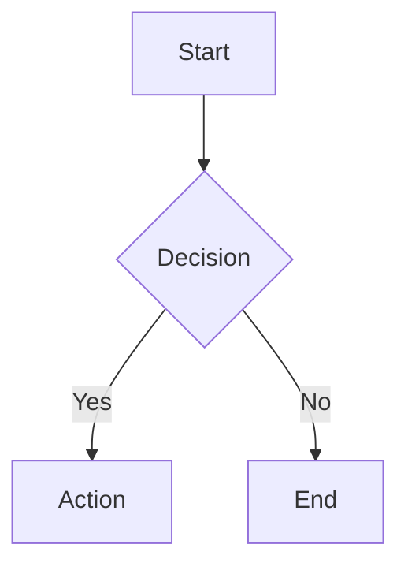
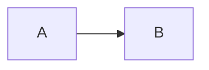

# Mermaid.js v11

## Overview

Create text-based diagrams using Mermaid.js v11 declarative syntax. Convert code to SVG/PNG/PDF via CLI or render in browsers/markdown files.

## Quick Start

**Basic Diagram Structure:**
```
{diagram-type}
  {diagram-content}
```

**Common Diagram Types:**
- `flowchart` - Process flows, decision trees
- `sequenceDiagram` - Actor interactions, API flows
- `classDiagram` - OOP structures, data models
- `stateDiagram` - State machines, workflows
- `erDiagram` - Database relationships
- `gantt` - Project timelines
- `journey` - User experience flows

See `references/diagram-types-core.md` and `references/diagram-types-planning.md` / `references/diagram-types-technical.md` for all 24+ types.

## Creating Diagrams

**Inline Markdown Code Blocks:**
````markdown

````

**Configuration via Frontmatter:**
````markdown

````

**Comments:** Use `%% ` prefix for single-line comments.

## CLI Usage

Convert `.mmd` files to images:
```bash
# Installation
npm install -g @mermaid-js/mermaid-cli

# Basic conversion
mmdc -i diagram.mmd -o diagram.svg

# With theme and background
mmdc -i input.mmd -o output.png -t dark -b transparent

# Custom styling
mmdc -i diagram.mmd --cssFile style.css -o output.svg
```

See `references/cli-commands.md` for Docker, flags, and troubleshooting.
See `references/cli-workflows.md` for config files, Node.js API, and CI/CD patterns.

## JavaScript Integration

**HTML Embedding:**
```html
<pre class="mermaid">
  flowchart TD
    A[Client] --> B[Server]
</pre>
<script src="https://cdn.jsdelivr.net/npm/mermaid@latest/dist/mermaid.min.js"></script>
<script>mermaid.initialize({ startOnLoad: true });</script>
```

See `references/integration-browser.md` for React, Vue, and Markdown integration.
See `references/integration-api.md` for API methods and advanced rendering patterns.

## Configuration & Theming

**Common Options:**
- `theme`: "default", "dark", "forest", "neutral", "base"
- `look`: "classic", "handDrawn"
- `fontFamily`: Custom font specification
- `securityLevel`: "strict", "loose", "antiscript"

See `references/configuration-options.md` for core options, layout, security.
See `references/configuration-theming.md` for theme variables, icons, math, accessibility.

## Practical Patterns

Load `references/examples-core.md`, `references/examples-data.md`, and `references/examples-advanced.md` for real-world diagram patterns.

## Resources

- `references/diagram-types-core.md` - Flowchart, sequence, class, state, ER, Gantt syntax
- `references/diagram-types-planning.md` - Journey, kanban, C4, architecture, pie, data viz
- `references/diagram-types-technical.md` - Git graph, timeline, mindmap, packet, ZenUML
- `references/configuration-options.md` - Config options, layout, security, validation
- `references/configuration-theming.md` - Themes, theme variables, icons, math, accessibility
- `references/cli-commands.md` - CLI install, commands, flags, Docker, troubleshooting
- `references/cli-workflows.md` - Config files, Node.js API, CI/CD workflows
- `references/integration-browser.md` - HTML, React, Vue, Markdown embedding
- `references/integration-api.md` - JS API methods, events, advanced patterns
- `references/examples-core.md` - Architecture, API docs, state machines, CI/CD
- `references/examples-data.md` - Database schemas, OOP class diagrams, REST maps
- `references/examples-advanced.md` - Planning, C4, git branching, infra, data viz
