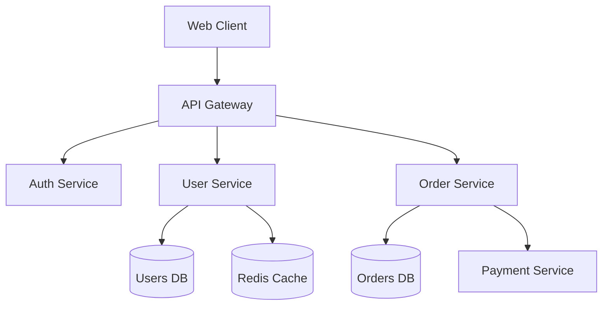
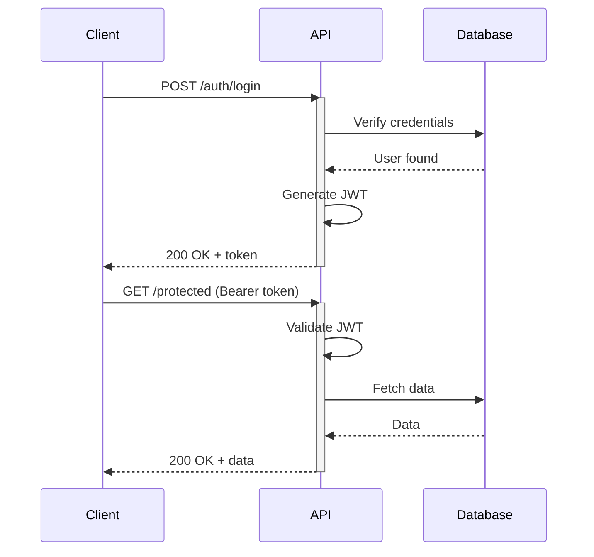
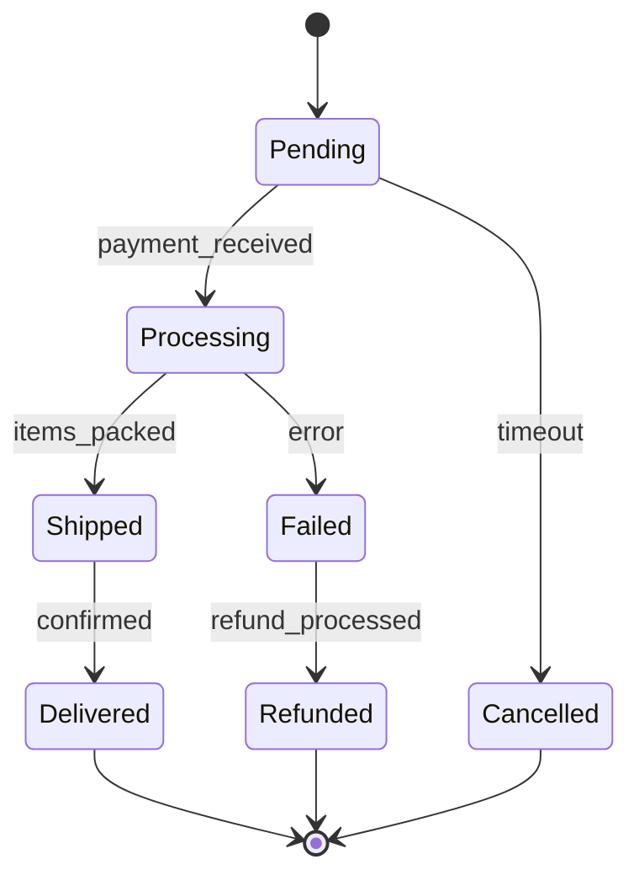
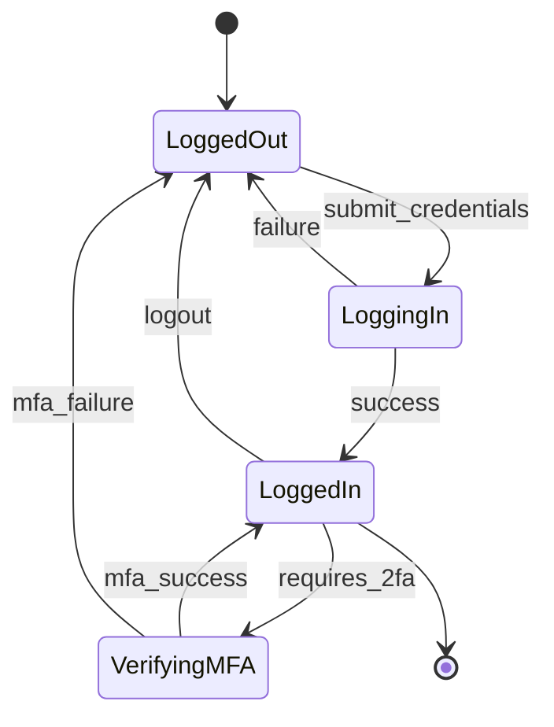
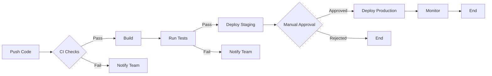

# Mermaid.js Examples: Core Diagrams

Real-world patterns for architecture, API, and state machine documentation.

## Software Architecture

**Microservices Architecture:**

## API Documentation

**Authentication Flow:**

## State Machines

**Order Processing:**

**User Authentication States:**

## CI/CD Pipeline

**Deployment Flow:**

