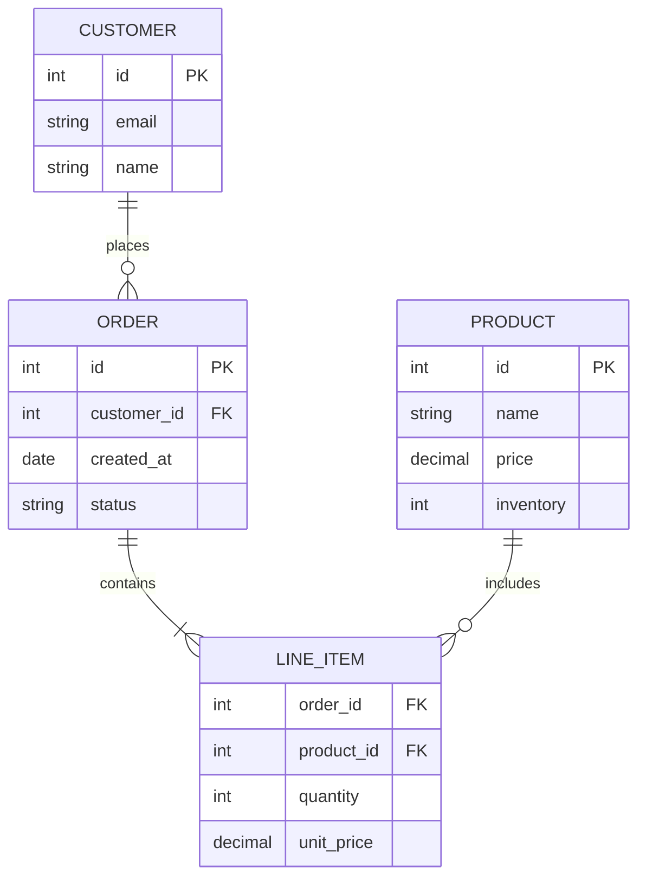
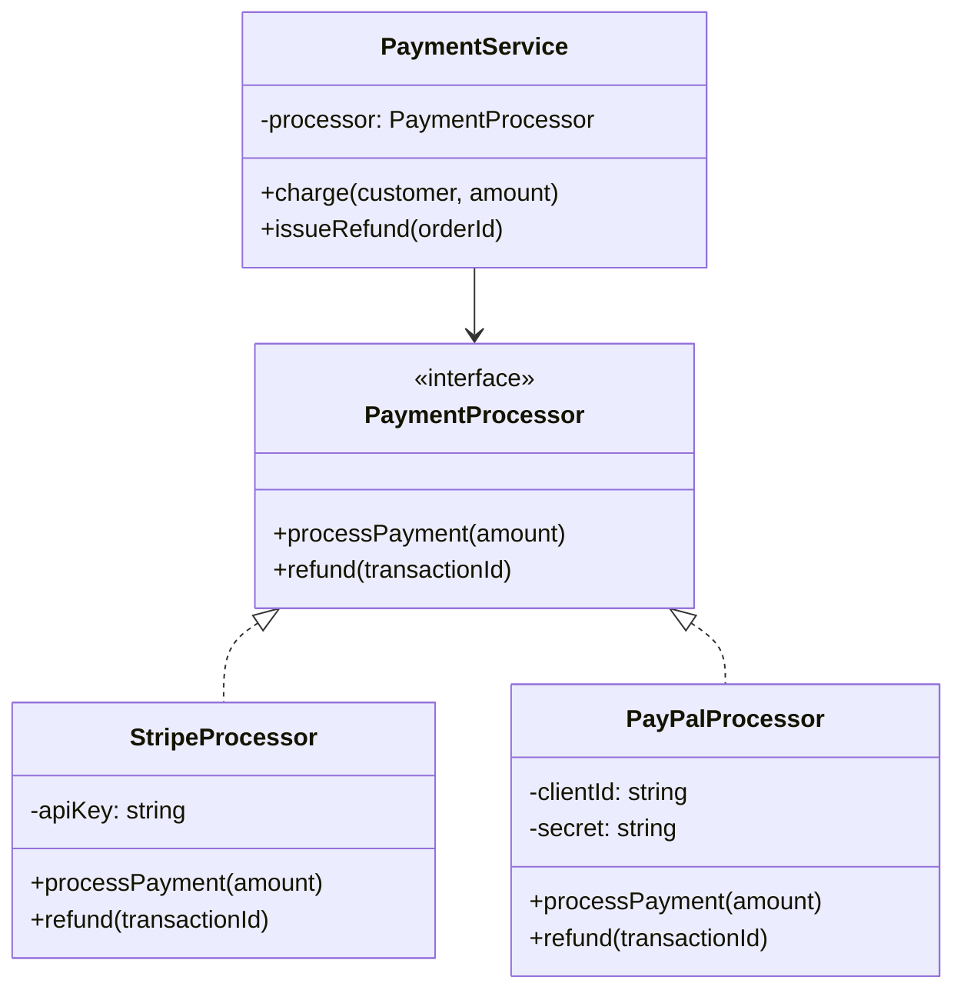

# Mermaid.js Examples: Database & OOP Diagrams

Database schemas, class diagrams, and REST API endpoint documentation.

## Database Design

**E-Commerce Schema:**


## Object-Oriented Design

**Payment System Classes:**


## API Endpoint Map

**REST API Endpoints:**
```mermaid
flowchart LR
  API[API]
  Users[/users]
  Posts[/posts]
  Comments[/comments]

  API --> Users
  API --> Posts
  API --> Comments

  Users --> U1[GET /users]
  Users --> U2[POST /users]
  Users --> U3[GET /users/:id]
  Users --> U4[PUT /users/:id]
  Users --> U5[DELETE /users/:id]
```
